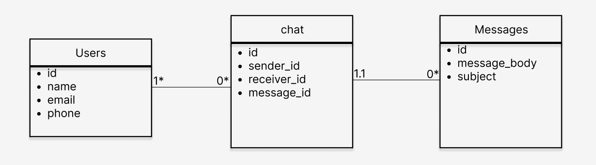

# PG209 Backend programmering eksamen

## Sjekkliste for innleveringen

* [x] Dere har lest eksamensteksten
* [x] Koden er sjekket inn på github.com/pg209-2022 repository
* [ ] Dere har lastet opp en ZIP-fil lastet ned fra Github
* [x] Dere har committed kode med begge prosjektdeltagernes GitHub-konto (alternativt: README beskriver hvordan dere har jobbet)

## README.md

* [x] Inneholder link til Azure Websites deployment
* [x] Inneholder en korrekt badge til GitHub Actions
* [x] Beskriver hva dere har løst utover minimum
* [x] Inneholder et diagram over databasemodellen

## Koden

* [x] Oppfyller Java kodestandard med hensyn til indentering og navngiving
* [x] Er deployet korrekt til Azure Websites
* [x] Inneholder tester av HTTP og database-logikk
* [x] Bruker Flyway DB for å sette opp databasen
* [x] Skriver ut nyttige logmeldinger

## Basisfunksjonalitet

* [x] Kan velge hvilken bruker vi skal opptre som
* [x] Viser eksisterende meldinger til brukeren
* [x] Lar brukeren opprette en ny melding
* [x] Lar brukeren svare på meldinger
* [x] For A: Kan endre navn og annen informasjon om bruker (Visar detta i tester)
* [x] For A: Meldingslisten viser navnet på avsender og mottakere

## Kvalitet

* [x] Datamodellen er *normalisert* - dvs at for eksempel navnet på en meldingsavsender ligger i brukertallen, ikke i meldingstabellen
* [x] Når man henter informasjon fra flere tabellen brukes join, i stedet for 1-plus-N queries (et for hovedlisten og et per svar for tilleggsinformasjon)
* [x] Det finnes test for alle JAX-RS endpoints og alle DAO-er

### Chat  
Link to azure:
https://pgr209-exam-2022-1009.azurewebsites.net/

Vår databasemodell:

I vår databasemodell har vi valgt å bruke tre tabeller:
- Brukere har kolonnene id, navn, e-post og telefonnummer
- Chat har kolonnene id, senderid, reciverid og messageid
- Meldinger har kolonnene id, messagebody og emne

Chat-tabellen fungerer som en tråd mellom messages og user tabellene. En chat/tråd må ha 1 eller flere users. 
Users trenger ikke ha en chat/tråd, men kan ha flere chatter/tråder.
Messages kan kun ha en chat/tråd, da vi har valgt at det ikke er mulig å sende gruppemeldinger. 
En chat/tråd trenger ikke ha en messages, men kan ha flere meddages.

I vår frontend klikker du på hvem du vil sende en melding fra og hvem du vil sende til.
For å se meldingshistorikken for hver bruker, klikk på brukernavnet under sender. 
Du ser også hvem som er sender og hvem som er receiver og kan med det svaret ved å endre receiver med et enkelt tasketrykk.

I vår frontend er det kun mulig å sende/svare og se meldinger som bruker har skrevet eller mottatt.
For å minimere tid brukt på frontend kode, har vi i stedet løst flere funksjonaliteter ved hjelp av tester. 
I testene vil du se at det er mulig å slette en melding,
oppdatere informasjon om en bruker, returnere melding etter emne, opprette ny bruker, samt se melding basert på bruker.

Samarbeidet under dette prosjektet har gått veldig bra. Vi har både jobbet sammen på skolen, på discord samtidig 
som vi deler skjerm eller hver for seg med ulike oppgaver. 
Vi har begge committed til Github fra begge Github-kontoene. 
Samtidig har vi vært flinke til å ta hverandre gjennom vår kode for at begge skal forstå hva den andre har gjort.

Funksjonalitet utover minimum
- Kan endre informasjon om eksisterende bruker (vist gjennom tester i UserDaoTest og ChatServerTest)
- Bruker lagrer i tillegg mobil nummer
- Meldinger viser avsender og mottaker (gjort med join, vist i tester og på frontend)
- meldinger kan slettes (vist med test i MessageDaoTest)

